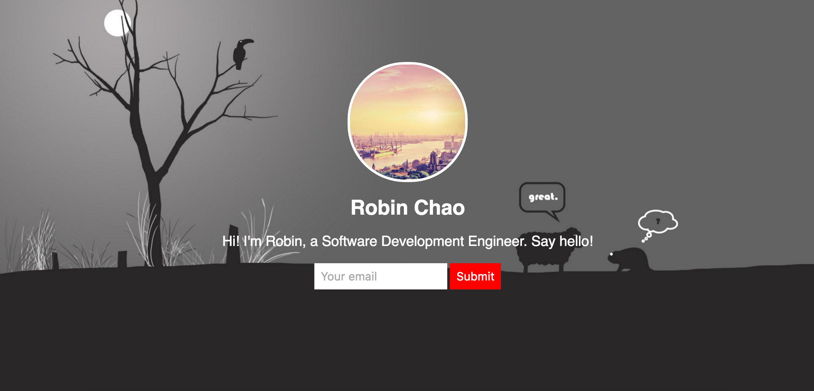

# First Personal Website

### Preview



### code

```
<!DOCTYPE html>
<head>
  <title>Robin Chao</title>
  <style>
    body {
      text-align: center; 
      background: url("http://www.deskcar.com/desktop/cartoon/china/2012317210314/17.jpg");
      background-size: cover;
      background-position: center; 
      color: white;
      font-family: helvetica;
    } 
    
    p {
      font-size: 22px; 
    }
    
    input {
      border: 0;
      padding: 10px;
      font-size: 18px;
    }
    
    input[type="submit"] {
      background: red;
      color: white;
    }
    
    img {
      width: 180px;
      border-radius: 90px;
      border: 4px solid;
      border-color: white;
      margin-top: 90px;
    }
  </style>
</head> 

<body>
  
  <h1>Robin Chao</h1>
  <p>Hi! I'm Robin, a Software Development Engineer. Say hello!</p>
  
  <input type="email" placeholder="Your email">
  <input type="submit">
</body>
```