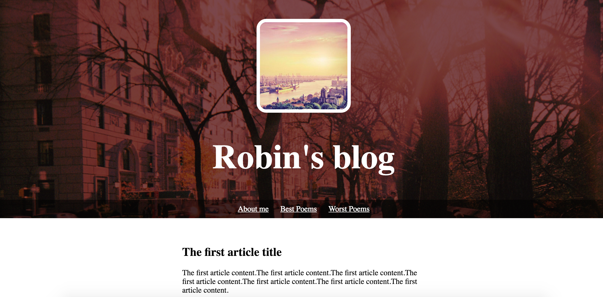
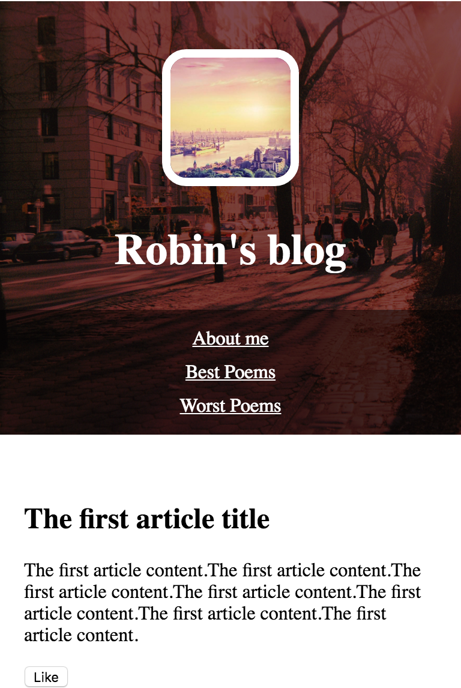

# First Personal Website

### Preview

 



### code

```
<!DOCTYPE html>
<head>
	<style type="text/css">
	header {
		text-align: center;
		background: url("http://dash.ga.co/assets/jeff-bg.png");
		background-size: cover;
		color: white;
	}

	a {
		color: white;
	}

	h1 {
		font-size: 70px;
	}

	img {
		width: 180px;
		margin: 40px 0px 0px 0px;
		border: 7px solid white;
		border-radius: 20px;
	}

	ul {
		padding: 10px;
		background: rgba(0,0,0,0.5);
	}

	li {
		display: inline;
		padding: 0px 10px 0px 10px;
	}

	article {
		max-width: 500px;
		padding: 20px;
		margin: 0 auto;
	}

	@media(max-width: 500px) {
		h1 {
			font-size: 36px;
			padding: 5px;
		}

		li {
			padding: 5px;
			display: block;
		}

		img {
			width: 100px;
		}
	}

	</style>

</head>

<body>
	<header>
		
		<h1>Robin's blog</h1>
		<ul>
			<li><a href="#">About me</a></li>
			<li><a href="#">Best Poems</a></li>
			<li><a href="#">Worst Poems</a></li>
		</ul>
	</header>

	<article>
		<h2>The first article title</h2>
		<p>The first article content.The first article content.The first article content.The first article content.The first article content.The first article content.The first article content.</p>
		<button>Like</button>
	</article>

	<article>
		<h2>The second article title</h2>
		<p>The second article content.The second article content.The second article content.The first article content.The second article content.The second article content.The first article content.</p>
		<button>Like</button>
	</article>

	<article>
		<h2>The third article title</h2>
		<p>The third article content.The third article content.The third article content.The first article content.The third article content.The third article content.The first article content.</p>
		<button>Like</button>
	</article>

	<script type="text/javascript">
		$("button").on("click", function() {
			alert("Clciked!!!");  
		});
	</script>
</body>
```